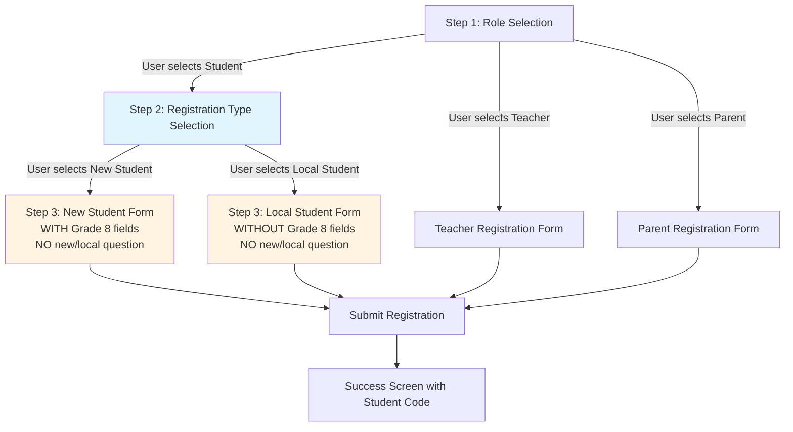

# Design Document: Student Registration Separation

## Overview

This design separates the student registration process into two distinct flows optimized for different user types: new students joining high school for the first time, and local students already in the school system. The design removes security questions from all registration flows and introduces a clear registration type selection step for students.

The solution maintains the existing three-step registration flow (role selection → type selection → form) but creates two separate form implementations for students. The backend API will be updated to handle different validation rules based on registration type, and the database schema will be extended to store Grade 8 information for new students.

### Registration Flow Diagram



**Key Points:**
- The "new vs local" question appears ONLY in Step 2 (Registration Type Selection)
- Step 3 forms do NOT ask this question again - they simply show the appropriate fields
- The registrationType state variable controls which form is rendered in Step 3

## Architecture

### Frontend Architecture

The registration page will use a state machine approach with three main steps:

1. **Step 1: Role Selection** - User chooses between Student, Teacher, or Parent
2. **Step 2: Registration Type Selection** (Students only) - User chooses between New Student or Local Student
   - **CRITICAL:** This is the ONLY place where the "new vs local" question appears
   - User makes their selection here and moves to Step 3
3. **Step 3: Registration Form** - User completes the appropriate form based on their Step 2 selection
   - **CRITICAL:** The form does NOT ask "Are you new to high school?" again
   - The form simply shows the appropriate fields (with or without Grade 8 info) based on the registrationType state

**Flow Example:**
- User selects "Student" (Step 1) → Sees "New Student" vs "Local Student" choice (Step 2) → Selects "New Student" → Sees New Student Registration Form with Grade 8 fields (Step 3)
- The form in Step 3 does NOT have radio buttons or any question about new/local - it's already determined

The component will maintain state for:
- Current step (1, 2, or 3)
- Selected role (student, teacher, parent)
- Registration type (new, local) - for students only, set in Step 2
- Form data with all fields
- Loading and error states

### Backend Architecture

The Laravel backend will:
- Extend the existing `AuthController@register` method to handle new validation rules
- Add conditional validation based on a new `registration_type` field
- Extend the Student model and database table to store Grade 8 information
- Maintain backward compatibility with existing teacher and parent registration

### Data Flow

```
User → Role Selection → [If Student] → Type Selection → Form → Frontend Validation → 
API Request → Backend Validation → Database Storage → Email/SMS Notifications → Success Screen
```

## Components and Interfaces

### Frontend Components

#### 1. RegisterPage Component (Modified)

**State Management:**
```javascript
const [step, setStep] = useState(1); // 1: Role, 2: Type (students), 3: Form
const [selectedRole, setSelectedRole] = useState('');
const [registrationType, setRegistrationType] = useState(''); // 'new' or 'local' - SET IN STEP 2
const [formData, setFormData] = useState({
  // Common fields
  name: '',
  email: '',
  phone: '',
  password: '',
  password_confirmation: '',
  role: '',
  gender: '',
  student_id: '',
  class_id: '',
  
  // New student specific
  grade: '9', // Auto-set for new students
  previous_school: '',
  grade_8_result: '',
  grade_8_evaluation: '',
  
  // Local student specific
  // grade: '', // User selectable for local students
  
  // Teacher/Parent fields (unchanged)
  // ...
});
```

**Key Methods:**
- `handleRoleSelect(role)` - Sets role and navigates to appropriate next step
- `handleRegistrationTypeSelect(type)` - **Sets registrationType state ('new' or 'local') and navigates to Step 3**
- `renderNewStudentForm()` - Renders form with Grade 8 fields (NO question about new/local)
- `renderLocalStudentForm()` - Renders form without Grade 8 fields (NO question about new/local)
- `handleSubmit()` - Validates and submits registration data

**Rendering Logic:**
```javascript
// Step 3: Render the appropriate form based on registrationType state
if (step === 3 && selectedRole === 'student') {
  if (registrationType === 'new') {
    return renderNewStudentForm(); // Shows Grade 8 fields, NO radio buttons
  } else if (registrationType === 'local') {
    return renderLocalStudentForm(); // No Grade 8 fields, NO radio buttons
  }
}
```

#### 2. Registration Type Selection Screen (New)

A new UI screen that appears only for students, presenting two clear, visually distinct options with explicit descriptions to eliminate confusion:

**New Student Card:**
- Icon: Plus/Add symbol or graduation cap
- **Title: "New Student - First Time in High School"**
- **Main Description: "Choose this if you are entering Grade 9 for the first time"**
- **Bullet Points:**
  - ✓ You just completed Grade 8
  - ✓ This is your first year in high school
  - ✓ You will be placed in Grade 9
  - ℹ️ You'll need your Grade 8 school information and results

**Local Student Card:**
- Icon: Checkmark/Existing symbol or school building
- **Title: "Local Student - Already in High School"**
- **Main Description: "Choose this if you are already enrolled in this high school"**
- **Bullet Points:**
  - ✓ You are currently in Grade 10, 11, or 12
  - ✓ You are continuing your education here
  - ✓ You can select your current grade
  - ℹ️ No Grade 8 information needed

**Visual Design Requirements:**
- Cards should be side-by-side on desktop, stacked on mobile
- Each card should have distinct visual styling (different accent colors or borders)
- Use clear, large typography for titles and main descriptions
- Bullet points should use checkmarks (✓) and info icons (ℹ️) for visual clarity
- Hover/focus states should clearly indicate which card is selectable
- Selected card should have a clear visual indicator before proceeding to Step 3

#### 3. New Student Registration Form (New)

**IMPORTANT:** This form should NOT ask "Are you new to high school?" - that question was already answered in Step 2 (Registration Type Selection). This form only collects the student's information.

**Required Fields:**
- Full Name *
- Email Address *
- Password *
- Confirm Password *
- Gender * (dropdown: Male, Female)
- Grade Level (auto-set to 9, displayed as read-only or hidden)
- Previous School * (text input)
- Grade 8 Result * (text input, e.g., "85%", "3.5 GPA", "A")
- Grade 8 Evaluation Method * (dropdown: Percentage, GPA, Letter Grade, Points, Other)

**Optional Fields:**
- Phone Number (for SMS notifications)
- Student ID
- Class (dropdown from available classes)

**Visual Design:**
- NO radio buttons or selection for "new vs local" - user already made this choice in Step 2
- Grade 8 information section highlighted with blue background
- Clear labels and helpful placeholder text
- Tooltips explaining why Grade 8 information is needed
- Form title: "New Student Registration" (to remind user of their selection)

#### 4. Local Student Registration Form (New)

**IMPORTANT:** This form should NOT ask "Are you new to high school?" - that question was already answered in Step 2 (Registration Type Selection). This form only collects the student's information.

**Required Fields:**
- Full Name *
- Email Address *
- Password *
- Confirm Password *
- Gender * (dropdown: Male, Female)
- Grade Level * (dropdown: 9, 10, 11, 12)

**Optional Fields:**
- Phone Number (for SMS notifications)
- Student ID
- Class (dropdown from available classes)

**Visual Design:**
- NO radio buttons or selection for "new vs local" - user already made this choice in Step 2
- Simpler, cleaner form without Grade 8 section
- Same styling as new student form for consistency
- Form title: "Local Student Registration" (to remind user of their selection)

### Backend API

#### Modified Endpoint: POST /api/register

**Request Body (New Student):**
```json
{
  "name": "John Doe",
  "email": "john@example.com",
  "phone": "+1234567890",
  "password": "password123",
  "password_confirmation": "password123",
  "role": "student",
  "registration_type": "new",
  "gender": "male",
  "grade": "9",
  "previous_school": "ABC Elementary School",
  "grade_8_result": "85%",
  "grade_8_evaluation": "percentage",
  "student_id": "",
  "class_id": ""
}
```

**Request Body (Local Student):**
```json
{
  "name": "Jane Smith",
  "email": "jane@example.com",
  "phone": "+1234567890",
  "password": "password123",
  "password_confirmation": "password123",
  "role": "student",
  "registration_type": "local",
  "gender": "female",
  "grade": "11",
  "student_id": "",
  "class_id": ""
}
```

**Response (Success):**
```json
{
  "success": true,
  "token": "sanctum_token_here",
  "user": {
    "id": 123,
    "name": "John Doe",
    "email": "john@example.com",
    "role": "student",
    "profile_picture": null,
    "profile_picture_url": null
  },
  "student_id": "STU2024123",
  "message": "Registration successful! Please check your email for verification code and login credentials."
}
```

**Validation Rules:**

For New Students:
```php
'registration_type' => 'required|in:new,local',
'gender' => 'required|in:male,female',
'grade' => 'required|in:9',
'previous_school' => 'required|string|max:255',
'grade_8_result' => 'required|string|max:50',
'grade_8_evaluation' => 'required|in:percentage,gpa,letter_grade,points,other'
```

For Local Students:
```php
'registration_type' => 'required|in:new,local',
'gender' => 'required|in:male,female',
'grade' => 'required|in:9,10,11,12'
```

## Data Models

### Student Model (Extended)

**New Fields:**
- `previous_school` (string, nullable) - Name of the school attended before high school
- `grade_8_result` (string, nullable) - Academic result from Grade 8
- `grade_8_evaluation` (string, nullable) - Method used to evaluate Grade 8 performance
- `gender` (string, nullable) - Student's gender

**Updated Fillable Array:**
```php
protected $fillable = [
    'user_id',
    'class_id',
    'student_code',
    'grade',
    'gender',
    'previous_school',
    'grade_8_result',
    'grade_8_evaluation'
];
```

### Database Migration

**Migration: add_grade_8_info_to_students_table**

```php
Schema::table('students', function (Blueprint $table) {
    $table->string('gender')->nullable()->after('grade');
    $table->string('previous_school')->nullable()->after('gender');
    $table->string('grade_8_result', 50)->nullable()->after('previous_school');
    $table->string('grade_8_evaluation', 50)->nullable()->after('grade_8_result');
});
```

## Correctness Properties

*A property is a characteristic or behavior that should hold true across all valid executions of a system—essentially, a formal statement about what the system should do. Properties serve as the bridge between human-readable specifications and machine-verifiable correctness guarantees.*

Before defining the correctness properties, let me analyze each acceptance criterion for testability:
