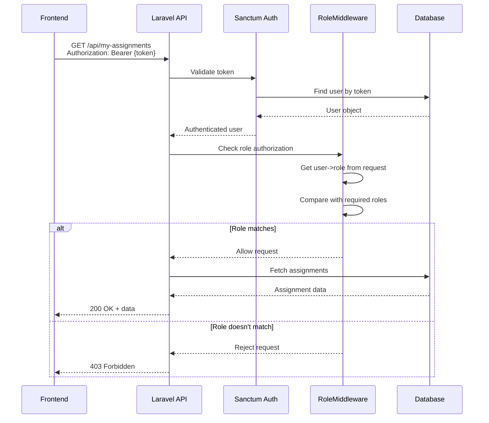

# Design Document: Teacher Assignments 403 Fix

## Overview

This design addresses a 403 Forbidden error occurring when teachers attempt to access the `/my-assignments` endpoint. The issue stems from the role-based authorization middleware (`RoleMiddleware`) that protects the endpoint.

### Problem Analysis

The endpoint is protected by two middleware layers:
1. `auth:sanctum` - Validates the bearer token and authenticates the user
2. `role:teacher` - Checks if the authenticated user has the "teacher" role

The 403 error indicates that authentication succeeds (user is logged in), but authorization fails (role check rejects the request). This suggests one of the following issues:

1. **Role value mismatch**: The user's role in the database doesn't match "teacher" (case sensitivity, whitespace, or different value)
2. **Token/user data issue**: The authenticated user object doesn't have the role field properly set
3. **Middleware logic error**: The RoleMiddleware has a bug in its comparison logic

### Current Implementation

**Backend (Laravel):**
- Route: `GET /api/my-assignments` protected by `auth:sanctum` and `role:teacher`
- RoleMiddleware checks: `in_array($request->user()->role, $roles)`
- User model has a `role` field (string, default: 'student')
- Login response includes user object with role field

**Frontend (Next.js):**
- Stores token and user object in localStorage after login
- Sends bearer token in Authorization header for all authenticated requests
- User object includes: id, name, email, role, profile_picture, profile_picture_url

## Architecture

### Diagnostic Flow

```
1. Database Inspection
   ├─> Query users table for teacher accounts
   ├─> Check role field values (exact strings)
   └─> Identify any case/whitespace issues

2. Authentication Flow Verification
   ├─> Test teacher login endpoint
   ├─> Inspect login response user object
   ├─> Verify role field in response
   └─> Confirm token generation

3. Frontend Storage Verification
   ├─> Check localStorage user object
   ├─> Verify JSON parsing preserves role
   └─> Confirm token is sent in requests

4. Middleware Debugging
   ├─> Add logging to RoleMiddleware
   ├─> Log: user ID, actual role, required roles
   ├─> Test /my-assignments endpoint
   └─> Analyze logs for mismatch

5. Fix Implementation
   ├─> Correct database role values if needed
   ├─> Fix middleware logic if needed
   ├─> Update frontend if needed
   └─> Add validation to prevent future issues
```

### Authorization Flow



## Components and Interfaces

### 1. Diagnostic Script

**Purpose**: Query database and inspect role values for all teacher accounts

**Interface**:
```php
class DiagnoseRoleIssue
{
    public function checkTeacherRoles(): array
    {
        // Returns: [
        //   'total_teachers' => int,
        //   'role_values' => ['teacher' => count, 'Teacher' => count, ...],
        //   'problematic_users' => [user_id => role_value]
        // ]
    }
    
    public function checkUserAuthentication(int $userId): array
    {
        // Returns: [
        //   'user_exists' => bool,
        //   'role' => string,
        //   'can_create_token' => bool,
        //   'token_test' => string|null
        // ]
    }
}
```

### 2. Enhanced RoleMiddleware

**Purpose**: Add diagnostic logging to identify authorization failures

**Interface**:
```php
class RoleMiddleware
{
    public function handle(Request $request, Closure $next, ...$roles): Response
    {
        // Log: user_id, user_role, required_roles, match_result
        // Return: 403 with diagnostic info in dev mode
    }
}
```

### 3. Role Validation Service

**Purpose**: Ensure role values are consistent and valid

**Interface**:
```php
class RoleValidationService
{
    const VALID_ROLES = ['admin', 'teacher', 'student', 'parent'];
    
    public function normalizeRole(string $role): string
    {
        // Returns: lowercase, trimmed role value
    }
    
    public function validateRole(string $role): bool
    {
        // Returns: true if role is in VALID_ROLES
    }
    
    public function fixIncorrectRoles(): array
    {
        // Returns: [
        //   'fixed_count' => int,
        //   'fixed_users' => [user_id => [old_role, new_role]]
        // ]
    }
}
```

### 4. Frontend Diagnostic Tool

**Purpose**: Verify localStorage data and token transmission

**Interface**:
```javascript
class AuthDiagnostics {
    checkLocalStorage() {
        // Returns: { hasToken, hasUser, userObject, roleValue }
    }
    
    testAuthenticatedRequest() {
        // Returns: { tokenSent, responseStatus, errorMessage }
    }
    
    verifyUserObject() {
        // Returns: { isValid, hasRole, roleValue, issues }
    }
}
```

## Data Models

### User Model (Existing)

```php
class User extends Authenticatable
{
    protected $fillable = [
        'name',
        'email',
        'phone',
        'password',
        'role',  // <-- Critical field
        'profile_picture',
        'verification_code',
        'verification_code_expires_at',
        'is_verified'
    ];
    
    // Role should be one of: 'admin', 'teacher', 'student', 'parent'
    // Must be lowercase for middleware comparison
}
```

### Teacher Model (Existing)

```php
class Teacher extends Model
{
    protected $fillable = [
        'user_id',  // <-- Foreign key to users table
        'subject_specialization',
        'qualification',
        'experience_years'
    ];
    
    public function user()
    {
        return $this->belongsTo(User::class);
    }
}
```

### Diagnostic Result Model (New)

```php
class RoleDiagnosticResult
{
    public int $userId;
    public string $userName;
    public string $userEmail;
    public string $actualRole;
    public array $expectedRoles;
    public bool $hasTeacherProfile;
    public bool $canAuthenticate;
    public ?string $issue;
}
```


## Correctness Properties

*A property is a characteristic or behavior that should hold true across all valid executions of a system—essentially, a formal statement about what the system should do. Properties serve as the bridge between human-readable specifications and machine-verifiable correctness guarantees.*

### Property Reflection

After analyzing all acceptance criteria, I identified several areas where properties can be consolidated:

**Redundancy Analysis:**
- Properties 2.1, 5.1, and 5.4 all relate to login response and storage - can be consolidated into comprehensive login/storage properties
- Properties 3.1, 3.3, and 3.4 all relate to role middleware authorization logic - can be consolidated into authorization decision properties
- Properties 6.1 and 6.2 both relate to logging - can be consolidated into comprehensive logging property
- Properties 7.1 and 7.3 both relate to role value normalization - can be consolidated
- Properties 8.1, 8.2, 8.3, and 8.4 all relate to role-based access control - can be consolidated into comprehensive RBAC property

**Consolidated Properties:**

### Property 1: Role Case Sensitivity Detection
*For any* user account in the database, if the role field contains uppercase characters or whitespace, the diagnostic tool should identify it as a case sensitivity issue.

**Validates: Requirements 1.2**

### Property 2: Teacher Role Consistency
*For any* user with an associated teacher profile record, the user's role field should be exactly "teacher" (lowercase, no whitespace).

**Validates: Requirements 1.4, 7.1**

### Property 3: Login Response Completeness
*For any* successful login (teacher, student, parent, or admin), the API response should include a user object containing all required fields: id, name, email, role, profile_picture, and profile_picture_url.

**Validates: Requirements 2.1**

### Property 4: LocalStorage Round-Trip Integrity
*For any* user object received from the login API, storing it in localStorage and then retrieving it should produce an equivalent object with no data loss, particularly preserving the role field.

**Validates: Requirements 2.2, 5.2**

### Property 5: Authentication Header Presence
*For any* authenticated API request made by the frontend, the request should include an Authorization header with a valid bearer token in the format "Bearer {token}".

**Validates: Requirements 2.3, 5.4**

### Property 6: Token User Resolution
*For any* valid Sanctum token, the RoleMiddleware should successfully retrieve the associated user object from the database.

**Validates: Requirements 2.4**

### Property 7: Role Middleware Authorization Decision
*For any* authenticated request to a role-protected endpoint:
- If the user's role matches any of the required roles (case-sensitive comparison), the request should proceed (200 OK)
- If the user's role does not match any required roles, the request should be rejected with 403 Forbidden

**Validates: Requirements 3.1, 3.2, 3.3, 3.4**

### Property 8: Authorization Diagnostic Logging
*For any* authorization check performed by RoleMiddleware, the system should log: user ID, user's actual role, required roles, and the authorization decision (allow/deny).

**Validates: Requirements 3.5, 6.1, 6.2**

### Property 9: Teacher Assignments Endpoint Access
*For any* teacher user with valid credentials and correct role value, a GET request to `/api/my-assignments` should return 200 OK with an array of assignment data.

**Validates: Requirements 4.1**

### Property 10: Descriptive Authorization Error Messages
*For any* authorization failure (403 response), the error response should include a descriptive message indicating the reason for failure (e.g., "Unauthorized - Insufficient permissions").

**Validates: Requirements 4.2**

### Property 11: Role-Based Access Control Integrity
*For any* role-protected endpoint and any user role:
- Teachers should access all teacher endpoints and be denied access to student/parent/admin endpoints
- Students should access all student endpoints and be denied access to teacher/parent/admin endpoints
- Parents should access all parent endpoints and be denied access to teacher/student/admin endpoints
- Admins should access all admin endpoints and be denied access to teacher/student/parent endpoints

**Validates: Requirements 4.3, 8.1, 8.2, 8.3, 8.4**

### Property 12: Authentication Method Compatibility
*For any* authentication method (email/password login, student name/ID login), successful authentication should produce a valid token and user object with the role field correctly set.

**Validates: Requirements 4.4**

### Property 13: Corrupted Data Handling
*For any* corrupted or invalid JSON in localStorage user data, the frontend should clear the stored token and user data, then redirect to the login page.

**Validates: Requirements 5.3**

### Property 14: Development Mode Diagnostic Information
*For any* 403 error in development environment, the error response should include diagnostic information (user ID, actual role, required roles) to aid debugging.

**Validates: Requirements 6.3**

### Property 15: Production Log Security
*For any* log entry in production environment, the log should not contain sensitive information such as passwords, tokens, or personal identification numbers.

**Validates: Requirements 6.4**

### Property 16: Role Value Normalization
*For any* role value provided during user creation or update, the system should normalize it to lowercase and trim whitespace before storage.

**Validates: Requirements 7.3**

### Property 17: Role Value Validation
*For any* role value provided during user creation or update, if the value is not in the allowed list ['admin', 'teacher', 'student', 'parent'], the operation should fail with a validation error.

**Validates: Requirements 7.4**

### Property 18: Incorrect Role Correction
*For any* user account with an incorrect role value (wrong case, whitespace, or mismatch with profile), the role correction script should identify and fix the role to the correct normalized value.

**Validates: Requirements 7.2**

## Error Handling

### Database Query Errors
- **Scenario**: Database connection fails during role verification
- **Handling**: Return diagnostic error with connection details, suggest checking database configuration
- **Logging**: Log full error stack trace with connection parameters (excluding credentials)

### Authentication Errors
- **Scenario**: Token is invalid or expired
- **Handling**: Return 401 Unauthorized, clear frontend storage, redirect to login
- **Logging**: Log token expiration or invalidity with user ID if available

### Authorization Errors
- **Scenario**: User role doesn't match required roles
- **Handling**: Return 403 Forbidden with descriptive message
- **Logging**: Log user ID, actual role, required roles, endpoint attempted
- **Development Mode**: Include diagnostic information in response body

### Data Corruption Errors
- **Scenario**: localStorage contains invalid JSON
- **Handling**: Clear corrupted data, redirect to login, show user-friendly message
- **Logging**: Log parsing error and corrupted data sample (first 100 chars)

### Role Mismatch Errors
- **Scenario**: User has teacher profile but role is not "teacher"
- **Handling**: Diagnostic script identifies mismatch, correction script fixes it
- **Logging**: Log user ID, profile type, incorrect role, corrected role

## Testing Strategy

This feature requires both unit tests and property-based tests to ensure comprehensive coverage of the diagnostic and fix functionality.

### Unit Testing Approach

Unit tests will focus on specific scenarios and edge cases:

1. **Database Diagnostic Tests**
   - Test querying users with various role values
   - Test identifying case sensitivity issues
   - Test schema validation

2. **Middleware Tests**
   - Test RoleMiddleware with matching roles
   - Test RoleMiddleware with non-matching roles
   - Test RoleMiddleware logging output

3. **Frontend Storage Tests**
   - Test storing user object in localStorage
   - Test retrieving user object from localStorage
   - Test handling corrupted localStorage data

4. **Integration Tests**
   - Test teacher login and /my-assignments access
   - Test student attempting to access teacher endpoint
   - Test role correction script

### Property-Based Testing Approach

Property-based tests will verify universal properties across many generated inputs. Each test should run a minimum of 100 iterations.

**Testing Library**: Use PHPUnit with property-based testing extensions for PHP backend, and fast-check for JavaScript frontend.

**Test Configuration**:
- Minimum 100 iterations per property test
- Each test tagged with: **Feature: teacher-assignments-403-fix, Property {number}: {property_text}**

**Property Test Examples**:

1. **Property 2: Teacher Role Consistency**
   - Generate: Random users with teacher profiles
   - Test: All should have role = "teacher"
   - Tag: **Feature: teacher-assignments-403-fix, Property 2: Teacher Role Consistency**

2. **Property 4: LocalStorage Round-Trip Integrity**
   - Generate: Random user objects with various field values
   - Test: Store → Retrieve → Compare for equality
   - Tag: **Feature: teacher-assignments-403-fix, Property 4: LocalStorage Round-Trip Integrity**

3. **Property 7: Role Middleware Authorization Decision**
   - Generate: Random users with various roles, random endpoints with required roles
   - Test: Matching roles → 200, Non-matching roles → 403
   - Tag: **Feature: teacher-assignments-403-fix, Property 7: Role Middleware Authorization Decision**

4. **Property 11: Role-Based Access Control Integrity**
   - Generate: All combinations of user roles and protected endpoints
   - Test: Verify correct access/denial for each combination
   - Tag: **Feature: teacher-assignments-403-fix, Property 11: Role-Based Access Control Integrity**

### Testing Balance

- **Unit tests**: Focus on specific examples (teacher accessing /my-assignments), edge cases (corrupted data), and error conditions (invalid tokens)
- **Property tests**: Focus on universal properties (all teachers can access teacher endpoints, all role values are normalized)
- Together, these provide comprehensive coverage: unit tests catch concrete bugs, property tests verify general correctness

### Test Execution Order

1. Run diagnostic script to identify current issues
2. Run unit tests for individual components
3. Run property tests for universal behaviors
4. Apply fixes based on diagnostic results
5. Re-run all tests to verify fixes
6. Run integration tests for end-to-end flows
